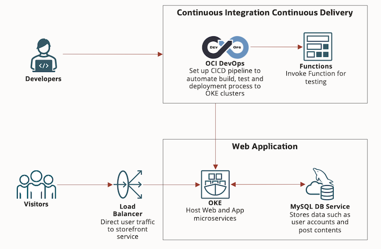

# Cloud Native Website on OCI Container Engine for Kubernetes (OKE) and MySQL Database Service



This pattern shows how to deploy a cloud native website on Oracle Cloud Infrastructure (OCI) Container Engine for Kubernetes (OKE) via Continuos Integration and Continuos Deployment (CICD) pipeline using OCI DevOps service and integrate with fully managed MySQL Database Service (MDS)

## **Overview:**

1) The website is built using **Nginx** and **PHP** as microservices and access MySQL Database Service.
2) Nginx is exposed as a service of type Load Balancer and it's listening on TCP port 5000. PHP and MySQL will not be exposed for external connectivity to reduce external attack surface.
3) Upon code commit to "main" branch, build pipeline will be triggered automatically to build and test the applications.
4) Deployment pipeline will be triggered automatically once build pipeline runs successfully to deploy application to test OKE cluster, test it, and deploy it to production OKE cluster.

## **1. Deploy OKE Cluster**

OCI provides one-click cluster deployment and will take care of creation of VCN, subnets, security list, Kubernetes Master and Worker Nodes.

## **2. Set up OCI DevOps CICD Pipeline**

### a. Create Project
```
Steps Here
```
### b. Create Code Repository
```
Steps Here
```
### c. Create Artifacts
```
Steps Here
```
### d. Create Environment
```
Steps Here
```
### e. Create Deployment Pipeline
```
Steps Here
```
### f. Create Build Pipeline
```
Steps Here
```
### g. Create Trigger
```
Steps Here
```

## **3. Trigger CICD Pipeline** 
```
Steps Here
```